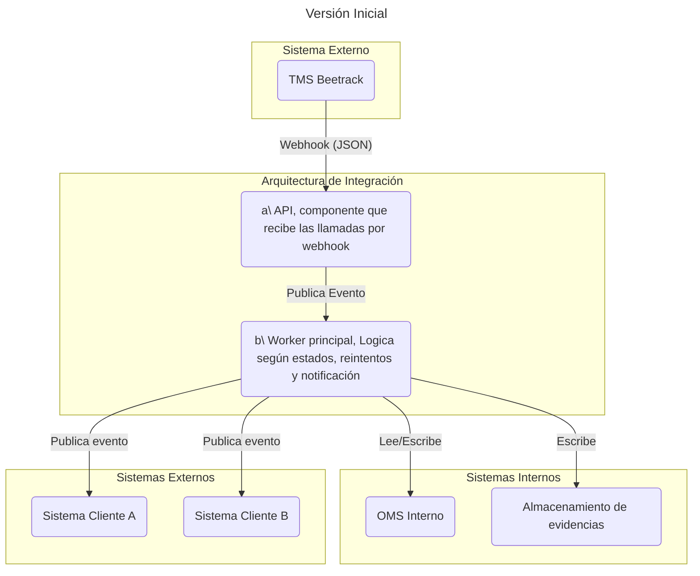
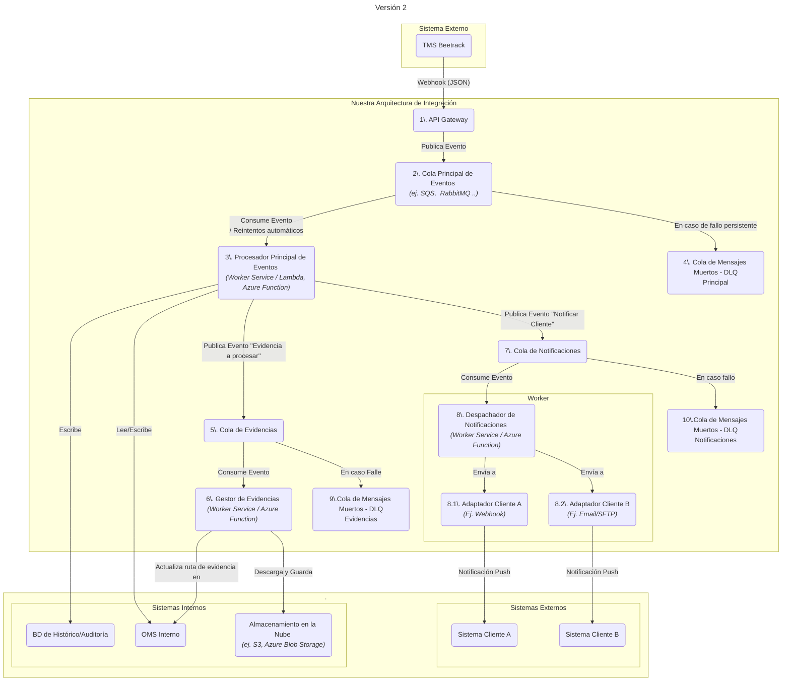
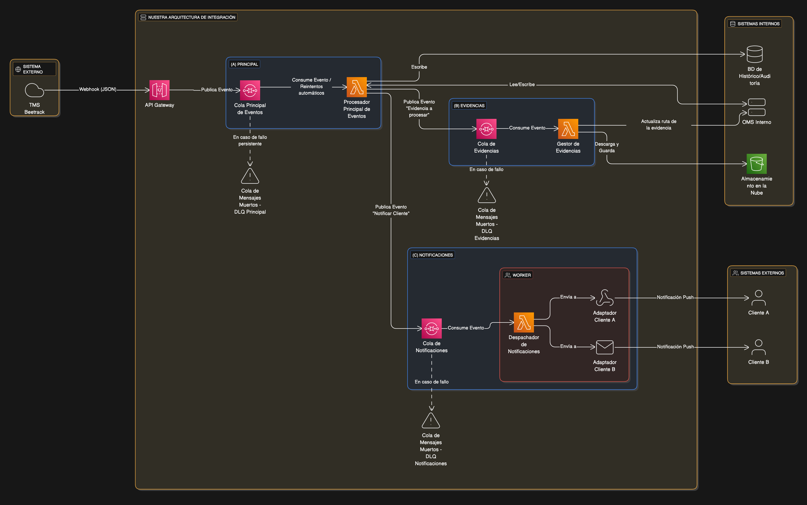
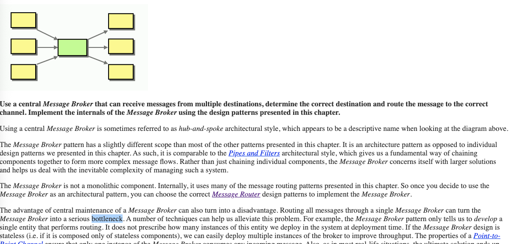
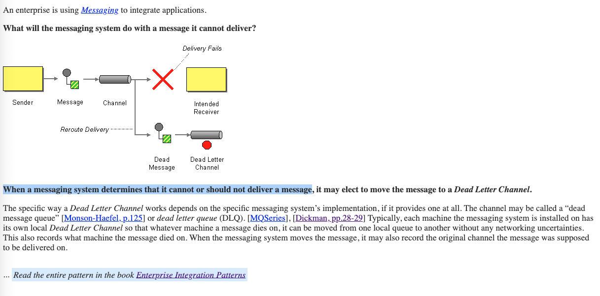
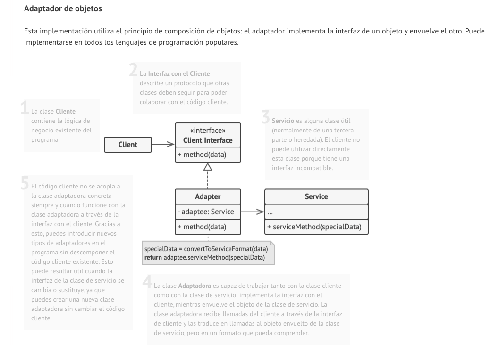

# Arqutiectura propuesta

# Versión Inicial ( Idea )

Se diagrama la idea principal o base de la arquitectura, para tener claro los componentes principales, el principal motivo de mejorar esta arquitectura es poder soportar miles de enviós diarios.

 
 

# Versión 2 ( según requerimientos )

Se detalla la arquitectura propuesta para la integración, considerando los requerimientos de escalabilidad, observabilidad y resiliencia.

## Diagrama de versión 2

 
 

## Diagrama de versión 2 como imagen con iconos de AWS

    

 
 

## Descripción de componentes

1. Api Gateway: 
   Único punto de entrada público, su única responsabilidad es recibir el webhook del TMS, Existe componente eespcializado en AWS y Azure para este trabajo. (Requisito de recibir en tiempo real y confirma la recepción)

2. Cola Principal de Eventos: 
   Persiste los eventos, asegurando que no se pierdan si los sistemas posteriores fallan. Permite que el Procesador Principal consuma los eventos a su propio ritmo. Se configura con una política de reintentos (ej. reintentar 3 veces con esperas exponenciales). Cumpliendo el requisito de Lógica de Reintentos.
3. Procesador principal de eventos: 
   El worker que procesa segun las reglas de negocio, según el estado y CUS que hemos analizado, actualiza el OMA y el contador de visitas.

4. Cola de Mensajes Muertos de los principales (DLQ):
   Si un mensaje falla repetidamente en la cola principal se mueve aquí.

5. Cola de Evidencias: 
   Si el evento contiene evidencias, el worker publica un nuevo mensaje en la Cola de Evidencias, estos para procesar por separado la gestión de evidencias.

6. Gestor de Evidencias: 
   Worker que se encarga de descargar las evidencias adjuntas y las actualiza en el OMS
7. Cola de Notificaciones: 
   Cola dedicada para manejar el envío de notificaciones a clientes.
8. Despachador de Notificaciones y Adaptadores:
   El despachador consume de la Cola de Notificaciones. Lee el mensaje, identifica al cliente y, basándose e invoca al "Adaptador" específico para ese cliente.

   - 8.1. y 8.2. Son adaptadores a nivel del código, según el cliente sms, android notificactions, apple notificatiosn, email, etc.

9. Colsa de Mesajes muertos DLQ: 
   Cola de mensajes muertos para la cola de evidencias.
10. Colsa de Mesajes muertos DLQ: 
    Cola de mensajes muertos para la cola de notificaciones.

## Justificación de patrones de diseño

- Arquitectura Orientada a Eventos (EDA): Elegida porque el problema es inherentemente basado en eventos ("el courier llegó", "el pedido fue entregado"), patron enfocada en eventos donde lso componentes reacciones y de forma asincrona.( https://aws.amazon.com/es/what-is/eda/)
 

    

 

- Message Queue (Broker): Garantiza que no se pierdan datos (persistencia), maneja picos ( miles de notificaciones) https://www.enterpriseintegrationpatterns.com/patterns/messaging/MessageBroker.html

 

    

 

- Dead-Letter Queue (DLQ): Es el patrón estándar para manejar errores irrecuperables de las colas, mas que guardar los mensajes el componente ofrece opciones de administración para auditarlos, notificar a soporte, reasignarlo a la cola principal una ves arreglado el problema. ( https://www.enterpriseintegrationpatterns.com/patterns/messaging/DeadLetterChannel.html )

 

    

 

- Adapter Pattern: Mas para la implementación donde se tiene interfaces de clientes, y se van implementando segun cada cliente.
  https://refactoring.guru/es/design-patterns/adapter

    

- No es un patron, pero se uso el principcio, de "Separación de responsabilidades", en lugar de un gran servicio monolítico, dividimos las tareas/responsabilidades en componente, asi poder escalar y tolerar la carga de notificaciones

# Mejoras

- Multi AZ segun la zona geografica para catastrofes
- Optimizacion de costos con tipos de storage
- CDN si se desea acceder a las fotos de forma mas rapida y con baja latencia
- Redudancia de la base de datos para accesos solo de lectura(replicas de lectura)
- Monitoreo y alarmas para los servicios(Healtchecks)
