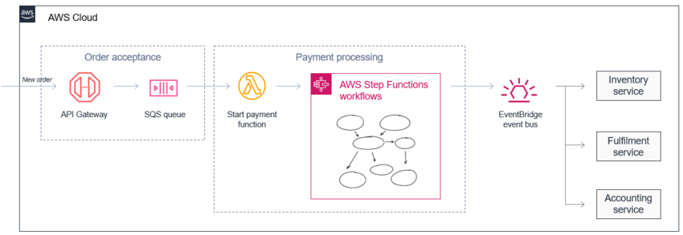

# <h1>Arquitectura propuesta</h1>

## Tabla de contenidos

- [Versión inicial (idea)](#versión-inicial-idea)
- [Versión 2 (según requerimientos)](#versión-2-según-requerimientos)
  - [Diagrama de versión 2](#diagrama-de-versión-2)
  - [Diagrama de versión 2 como imagen con iconos de AWS](#diagrama-de-versión-2-como-imagen-con-iconos-de-aws)
  - [Descripción de componentes](#descripción-de-componentes)
  - [Justificación de patrones de diseño](#justificación-de-patrones-de-diseño)
- [Mejoras](#mejoras)

 

# Versión inicial (idea)

Se diagrama la idea principal o base de la arquitectura para tener claros los componentes principales. El principal motivo de mejorar esta arquitectura es poder soportar miles de envíos diarios.

```mermaid
---
title: Versión Inicial
---
graph TD
    subgraph "Sistema Externo"
        TMS(TMS Beetrack)
    end

    subgraph "Arquitectura de Integración"
        API_Component(a\ API, componente que recibe las llamadas por webhook)
        WORKER(b\ Worker principal, Logica según estados, reintentos y notificación)
    end

    subgraph "Sistemas Internos"
        OMS(OMS Interno)
        Storage(Almacenamiento de evidencias)
    end

    subgraph "Sistemas Externos"
        Client_A(Sistema Cliente A)
        Client_B(Sistema Cliente B)
    end

    TMS -- Webhook (JSON) --> API_Component
    API_Component -- Publica Evento --> WORKER
    WORKER -- Lee/Escribe --> OMS
    WORKER -- Escribe --> Storage
    WORKER -- Publica evento --> Client_A
    WORKER -- Publica evento --> Client_B

```

 
 

# Versión 2 (según requerimientos)

Se detalla la arquitectura propuesta para la integración, considerando los requerimientos de escalabilidad, observabilidad y resiliencia.

## Diagrama de versión 2

```mermaid
---
title: Versión 2
---
graph TD
    subgraph "Sistema Externo"
        TMS(TMS Beetrack)
    end

    subgraph "Nuestra Arquitectura de Integración"
        API_Gateway(1\. API Gateway)
        Main_Queue("2\. Cola Principal de Eventos <br><i>(ej. SQS,  RabbitMQ ..)</i>")
        Processor("3\. Procesador Principal de Eventos <br><i>(Worker Service / Lambda, Azure Function)</i>")
        DLQ("4\. Cola de Mensajes Muertos - DLQ<br>Principal")


        Evidence_Queue(5\. Cola de Evidencias)
        Evidence_Handler("6\. Gestor de Evidencias <br><i>(Worker Service / Azure Function)</i>")
        Notification_Queue(7\. Cola de Notificaciones)

        subgraph "Worker"
            Notification_Dispatcher("8\. Despachador de Notificaciones <br><i>(Worker Service / Azure Function)</i>")
            Adapter_A("8.1\. Adaptador Cliente A<br><i>(Ej. Webhook)</i>")
            Adapter_B("8.2\. Adaptador Cliente B<br><i>(Ej. Email/SFTP)</i>")
        end


        DLQ2("9\.Cola de Mensajes Muertos - DLQ<br>Evidencias")
        DLQ3("10\.Cola de Mensajes Muertos - DLQ<br>Notificaciones")
    end

    subgraph "."
        subgraph "Sistemas Internos"
            OMS(OMS Interno)
            History_DB(BD de Histórico/Auditoría)
            Cloud_Storage("Almacenamiento en la Nube <br><i>(ej. S3, Azure Blob Storage)</i>")
        end

        subgraph "Sistemas Externos"
            Client_A(Sistema Cliente A)
            Client_B(Sistema Cliente B)
        end
    end

    %% Flujo Principal
    API_Gateway -- Publica Evento --> Main_Queue
    TMS -- Webhook (JSON) --> API_Gateway
    Processor -- Escribe --> History_DB
    Main_Queue -- Consume Evento<br> / Reintentos automáticos --> Processor
    Processor -- Lee/Escribe --> OMS
    Processor -- Publica Evento ''Evidencia a procesar''  --> Evidence_Queue
    Processor -- Publica Evento ''Notificar Cliente'' --> Notification_Queue

    %% Flujo de Reintentos y Errores
    Main_Queue -- En caso de fallo persistente --> DLQ


    %% Flujo de Evidencias (Asíncrono)
    Evidence_Queue -- Consume Evento --> Evidence_Handler
    Evidence_Queue -- En caso Falle --> DLQ2
    Evidence_Handler -- Actualiza ruta de evidencia en --> OMS
    Evidence_Handler -- Descarga y Guarda --> Cloud_Storage

    %% Flujo de Notificaciones (Asíncrono)
    Notification_Queue -- Consume Evento --> Notification_Dispatcher
    Notification_Queue -- En caso fallo --> DLQ3
    Notification_Dispatcher -- Envía a --> Adapter_A
    Notification_Dispatcher -- Envía a --> Adapter_B
    Adapter_A -- Notificación Push --> Client_A
    Adapter_B -- Notificación Push --> Client_B


```

<a href="images/mermaid_down.png">🔎 Ver diagrama</a>

 
 

## Diagrama de versión 2 como imagen con iconos de AWS

<a href="images/image_arq_eraser.png">🔎 Ver diagrama</a>

    

 
 

## Descripción de componentes

1. API Gateway: 
   Único punto de entrada público. Su única responsabilidad es recibir el webhook del TMS. Existe un componente especializado en AWS y Azure para este trabajo. (Requisito: recibir en tiempo real y confirmar la recepción)

2. Cola Principal de Eventos: 
   Persiste los eventos, asegurando que no se pierdan si los sistemas posteriores fallan. Permite que el Procesador Principal consuma los eventos a su propio ritmo. Se configura con una política de reintentos (p. ej., reintentar 3 veces con esperas exponenciales). Cumple el requisito de lógica de reintentos.

3. Procesador principal de eventos: 
   Worker que procesa según las reglas de negocio, según el estado y CUS que hemos analizado; actualiza el OMS y el contador de visitas.

4. Cola de Mensajes Muertos de los principales (DLQ): 
   Si un mensaje falla repetidamente en la cola principal, se mueve aquí.

5. Cola de Evidencias: 
   Si el evento contiene evidencias, el worker publica un nuevo mensaje en la Cola de Evidencias; esto para procesar por separado la gestión de evidencias.

6. Gestor de Evidencias: 
   Worker que se encarga de descargar las evidencias adjuntas y actualizarlas en el OMS.

7. Cola de Notificaciones: 
   Cola dedicada para manejar el envío de notificaciones a clientes.

8. Despachador de Notificaciones y Adaptadores: 
   El despachador consume de la Cola de Notificaciones. Lee el mensaje, identifica al cliente y, basándose en ello, invoca el "Adaptador" específico para ese cliente.

   - 8.1. y 8.2. Son adaptadores a nivel de código, según el cliente: SMS, notificaciones de Android, notificaciones de Apple, correo electrónico, etc.

9. Cola de Mensajes Muertos (DLQ): 
   Cola de mensajes muertos para la cola de evidencias.

10. Cola de Mensajes Muertos (DLQ): 
    Cola de mensajes muertos para la cola de notificaciones.

## Justificación de patrones de diseño

- Arquitectura Orientada a Eventos (EDA): Elegida porque el problema es inherentemente basado en eventos ("el courier llegó", "el pedido fue entregado"); patrón enfocado en eventos donde los componentes reaccionan de forma asíncrona. (https://aws.amazon.com/es/what-is/eda/)
 

    

 

- Message Queue (Broker): Garantiza que no se pierdan datos (persistencia) y maneja picos (miles de notificaciones). https://www.enterpriseintegrationpatterns.com/patterns/messaging/MessageBroker.html

 

    

 

- Dead-Letter Queue (DLQ): Es el patrón estándar para manejar errores irrecuperables de las colas; más que guardar los mensajes, el componente ofrece opciones de administración para auditarlos, notificar a soporte y reasignarlos a la cola principal una vez arreglado el problema. (https://www.enterpriseintegrationpatterns.com/patterns/messaging/DeadLetterChannel.html )

 

    

 

- Adapter Pattern: Más para la implementación donde se tienen interfaces de clientes y se van implementando según cada cliente.
  https://refactoring.guru/es/design-patterns/adapter

    

- No es un patrón, pero se usó el principio de "separación de responsabilidades": en lugar de un gran servicio monolítico, se dividieron las tareas/responsabilidades en componentes para poder escalar y tolerar la carga de notificaciones.

# Mejoras

- Multi-AZ según la zona geográfica para catástrofes.
- Optimización de costos con tipos de almacenamiento.
- CDN si se desea acceder a las fotos de forma más rápida y con baja latencia.
- Redundancia de la base de datos para accesos solo de lectura (réplicas de lectura).
- Monitoreo y alertas para los servicios (health checks).
