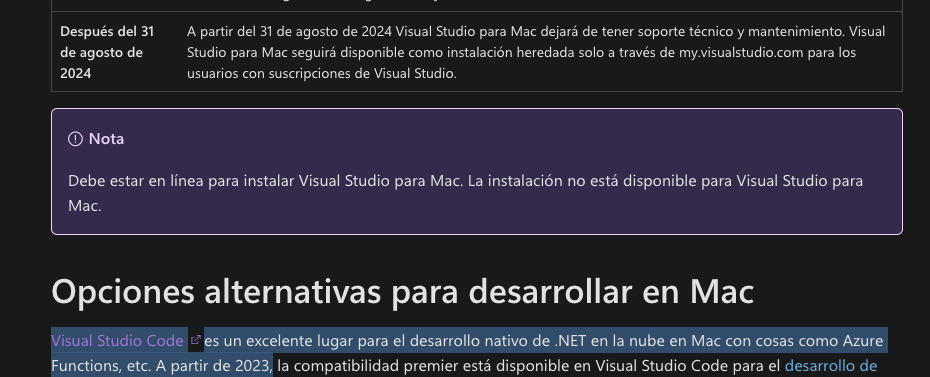

# Implementación

## Tabla de contenidos

- [Notas](#notas)
- [Backlog](#backlog)
- [Paso 0: SETUP](#paso-0-setup)
- [Paso 1: Crear la Estructura de la Solución.](#paso-1-crear-la-estructura-de-la-solucion)
  - [Representación](#representacion)
- [Paso 2: Definir Dominios y Contratos](#paso-2-definir-dominios-y-contratos)
- [Paso 3: Construir el Endpoint de la API](#paso-3-construir-el-endpoint-de-la-api)
- [Paso 4: Construir la Infraestructura Falsa](#paso-4-construir-la-infraestructura-falsa)
- [Paso 5: Construir los Workers de Fondo](#paso-5-construir-los-workers-de-fondo)
- [Paso 6: Implementar el Procesador Principal](#paso-6-implementar-el-procesador-principal)
- [Paso 7: Implementar los Procesadores Secundarios](#paso-7-implementar-los-procesadores-secundarios)
- [Paso 8: Configurar la Inyección de Dependencias](#paso-8-configurar-la-inyeccion-de-dependencias)
- [Paso 9: Añadir Logging Detallado](#paso-9-anadir-logging-detallado)
- [Paso 10: Pruebas](#paso-10-pruebas)
- [Paso 11: Documentar y Publicar](#paso-11-documentar-y-publicar)
- [Comandos útiles](#comandos-utiles)
- [Mejoras](#mejoras)

# Notas

- Se decidió usar Visual Studio Code en vez de Visual Studio; según su página, no tendrá soporte y será descontinuado.



# Backlog

[x] **Paso 0: Setup.**<br>
[x] **Paso 1: Crear la Estructura de la Solución.**<br>
[x] **Paso 2: Definir Dominios y Contratos.**<br>
[x] **Paso 3: Construir el Endpoint de la API.**<br>
[x] **Paso 4: Construir la Infraestructura Falsa.**<br>
[x] **Paso 5: Construir los Workers de Fondo.**<br>
[x] **Paso 6: Implementar el Procesador Principal.**<br>
[x] **Paso 7: Implementar los Procesadores Secundarios.**<br>
[x] **Paso 8: Configurar la Inyección de Dependencias.**<br>
[x] **Paso 9: Añadir Logging Detallado.**<br>
[x] **Paso 10: Pruebas.**<br>
[x] **Paso 11: Documentar y Publicar.**<br>

<br>
<br>

# Paso 0: SETUP

- Visual Studio Code<br>
  https://code.visualstudio.com/

- Instalación del SDK 8.0<br>
  https://dotnet.microsoft.com/es-es/download/dotnet/8.0

- Instalación de la extensión C# Dev Kit<br>
  https://marketplace.visualstudio.com/items?itemName=ms-dotnettools.csdevkit

# Paso 1: Crear la Estructura de la Solución.

```shell
javier@Javier pt_arq_int % tree -L 3
.
├── doc
├── IntegrationService.sln
├── readme.md
├── referencias.md
└── src
    ├── IntegrationService.Api
    │   ├── appsettings.Development.json
    │   ├── appsettings.json
    │   ├── IntegrationService.Api.csproj
    │   ├── IntegrationService.Api.http
    │   ├── obj
    │   ├── Program.cs
    │   └── Properties
    ├── IntegrationService.Application.Contracts
    │   ├── Class1.cs
    │   ├── IntegrationService.Application.Contracts.csproj
    │   └── obj
    ├── IntegrationService.Domain
    │   ├── Class1.cs
    │   ├── IntegrationService.Domain.csproj
    │   └── obj
    ├── IntegrationService.EventProcessing
    │   ├── Class1.cs
    │   ├── IntegrationService.EventProcessing.csproj
    │   └── obj
    └── IntegrationService.Infrastructure
        ├── Class1.cs
        ├── IntegrationService.Infrastructure.csproj
        └── obj

15 directories, 30 files
javier@MacStudio-de-Javier pt_arq_int %
```

```shell
# Verificación
dotnet build
...
# resultado
Build succeeded.
    0 Warning(s)
    0 Error(s)
```

## Representación

- API: representará el webhook.
- Infrastructure: tendrá las implementaciones
  - Queue: serán las colas Main, Evidence y Notification.
  - OrderRepository: será el sistema OMS.
  - EventHistoryRepository: será la BD de auditoría.
  - FakeCloudStorage: será el repositorio de evidencias.
  - ClientAWebHookAdapter y ClientMailAdapter: adaptadores de clientes.
- EventProcessing: tendrá los procesadores de eventos (workers) con la lógica de negocio
  - MainEventProcessor
  - EvidenceProcessor
  - NotificationProcessor
- Application.Contracts: tendrá los contratos o interfaces de cada componente.
- Domain: tendrá los modelos de datos que se usarán (el JSON del webhook).

# Paso 2: Definir Dominios y Contratos

- Se usó clases record para clases tipo DTO, es decir, de solo datos.
- Se usó métodos Task para indicar tareas asíncronas.
- Se usó CancellationToken, una clase que permite cancelar tareas desde otros hilos, enviándolo como referencia.

# Paso 3: Construir el Endpoint de la API

OK.

# Paso 4: Construir la Infraestructura Falsa

- Instalar la extensión de logging

```shell
dotnet add src/IntegrationService.Infrastructure/IntegrationService.Infrastructure.csproj package Microsoft.Extensions.Logging
```

- Se usó BlockingCollection, una clase especial para entornos concurrentes que permite agregar elementos y funciona con CancellationToken para cancelar sus operaciones.

# Paso 5: Construir los Workers de Fondo

- Paso crítico para preparar el flujo para las reglas de negocio con el dequeue de las colas.

# Paso 6: Implementar el Procesador Principal

- Se asumieron algunos casos no contemplados en el documento:
  - Qué pasa si la orden no existe en el OMS: se registra, pero se ignora el evento.
  - Si llega a 3 como contador de visitas, se procesa inmediatamente.
  - No se está implementando el patrón DLQ. Si ocurre un error, el proceso continúa; en un entorno real, SQS podría manejarlo según su configuración.

# Paso 7: Implementar los Procesadores Secundarios

- Similar al procesador principal.

# Paso 8: Configurar la Inyección de Dependencias

- Es la parte crítica de enlazar las interfaces con sus implementaciones y que corran los procesadores para ir tomando los eventos de las colas

```c#
...
// ejemplo de DI en API/program.cs
builder.Services.AddSingleton<IMainEventQueue, InMemoryMainEventQueue>();
builder.Services.AddSingleton<IEvidenceQueue, InMemoryEvidenceQueue>();
builder.Services.AddSingleton<INotificationQueue, InMemoryNotificationQueue>();
...
```

- Al ejecutar cada async task de los procesadores, debe ejecutarse de forma asíncrona para evitar bloqueos

```c#
...
await Task.Run(async () =>
        {
...
```

# Paso 9: Añadir Logging Detallado

- Se añadieron más logs.

# Paso 10: Pruebas

- Se realizaron pruebas.

```shell

# Se ejecuto el proyecto
dotnet run --project src/IntegrationService.Api/IntegrationService.Api.csproj
Building...
info: IntegrationService.EventProcessing.MainEventProcessor[0]
      Main Event Processor está iniciando.
info: IntegrationService.EventProcessing.EvidenceProcessor[0]
      Evidence Processor está iniciando.
info: IntegrationService.EventProcessing.NotificationProcessor[0]
      Notification Processor está iniciando.
info: Microsoft.Hosting.Lifetime[14]
      Now listening on: http://localhost:5241
info: Microsoft.Hosting.Lifetime[0]
      Application started. Press Ctrl+C to shut down.
info: Microsoft.Hosting.Lifetime[0]
      Hosting environment: Development
info: Microsoft.Hosting.Lifetime[0]
      Content root path: ../pt_arq_int/src/IntegrationService.Api
warn: Microsoft.AspNetCore.HttpsPolicy.HttpsRedirectionMiddleware[3]
      Failed to determine the https port for redirect.

# Se lanzo el curl CASO FELIZ

curl -X POST http://localhost:5241/api/webhook/tms-events \
-H "Content-Type: application/json" \
-d '{
  "serviceType": "LAST_MILE",
  "dispatchType": "HOME_DELIVERY",
  "status": "DELIVERED",
  "subStatus": "CLIENT_RECEIVED",
  "vehicleCode": "LIMURB06VAN",
  "courierName": "Conductor 46",
  "details": {
    "orderNumber": "2500000006-01",
    "trackingNumber": "OE2500000006-01",
    "clientCode": "01021755",
    "clientName": "TIENDAS PERUANAS S.A.",
    "receivedBy": "Pepito Perez",
    "comments": "Entregado en domicilio"
  },
  "evidences": [
    {
      "label": "Paquete",
      "fileType": "jpg",
      "fileName": "delivered_201054.jpg",
      "url": "https://beetrack.com/img/delivered_201054.jpg"
    },
    {
      "label": "Fachada",
      "fileType": "jpg",
      "fileName": "delivered_201055.jpg",
      "url": "https://beetrack.com/img/delivered_201055.jpg"
    }
  ],
  "eventDate": "2025-04-15T16:53:07Z"
}'


# Se mostrarón los logs

info: IntegrationService.Api.Controllers.WebhookController[0]
      => Webhook recibido! Evento 'DELIVERED' para la orden '2500000006-01'. Encolando...
info: IntegrationService.Api.Controllers.WebhookController[0]
      Evento para la orden '2500000006-01' encolado exitosamente en la cola principal. [Respondiendo 202 Accepted]
info: IntegrationService.EventProcessing.MainEventProcessor[0]
      <= Consumiendo evento 'DELIVERED' de la cola principal para la orden '2500000006-01'.
info: IntegrationService.Infrastructure.InMemoryEventHistoryRepository[0]
      Evento 'DELIVERED' para la orden '2500000006-01' registrado en el historial.
info: IntegrationService.Infrastructure.InMemoryOrderRepository[0]
      [OMS SIM] Buscando orden '2500000006-01'...
info: IntegrationService.Infrastructure.InMemoryOrderRepository[0]
      [OMS SIM] Orden '2500000006-01' encontrada con estado 'PLANNING'.
info: IntegrationService.EventProcessing.MainEventProcessor[0]
      Lógica de negocio: Estado de la orden '2500000006-01' actualizado a 'DELIVERED'.
info: IntegrationService.EventProcessing.MainEventProcessor[0]
      Lógica de negocio: Contador de visitas para la orden '2500000006-01' actualizado a 1.
info: IntegrationService.Infrastructure.InMemoryOrderRepository[0]
      [OMS SIM] Actualizando orden '2500000006-01' con estado 'DELIVERED' y 1 visitas.
info: IntegrationService.EventProcessing.MainEventProcessor[0]
      => Publicando tarea de evidencia ('delivered_201054.jpg') en la cola de evidencias.
info: IntegrationService.EventProcessing.MainEventProcessor[0]
      => Publicando tarea de evidencia ('delivered_201055.jpg') en la cola de evidencias.
info: IntegrationService.EventProcessing.EvidenceProcessor[0]
      <= Consumiendo evento de evidencia para la orden '2500000006-01', archivo 'delivered_201054.jpg'.
info: IntegrationService.EventProcessing.MainEventProcessor[0]
      => Publicando tarea de notificación para el cliente 'TIENDAS PERUANAS S.A.' en la cola de notificaciones.
info: IntegrationService.EventProcessing.NotificationProcessor[0]
      <= Consumiendo evento de notificación para el cliente 'TIENDAS PERUANAS S.A.' y la orden '2500000006-01'.
info: IntegrationService.Infrastructure.ClientAWebhookAdapter[0]
      [ADAPTADOR CLIENTE A - Webhook] Enviando notificación para la orden 2500000006-01. Nuevo estado: DELIVERED
info: IntegrationService.Infrastructure.FakeCloudStorage[0]
      Descargando archivo 'delivered_201054.jpg'...
info: IntegrationService.Infrastructure.FakeCloudStorage[0]
      Archivo 'delivered_201054.jpg' guardado en 'cloud-storage/2500000006-01/delivered_201054.jpg'.
info: IntegrationService.EventProcessing.EvidenceProcessor[0]
      Evidencia para la orden '2500000006-01' procesada y guardada en 'cloud-storage/2500000006-01/delivered_201054.jpg'.
info: IntegrationService.EventProcessing.EvidenceProcessor[0]
      <= Consumiendo evento de evidencia para la orden '2500000006-01', archivo 'delivered_201055.jpg'.
info: IntegrationService.Infrastructure.FakeCloudStorage[0]
      Descargando archivo 'delivered_201055.jpg'...
info: IntegrationService.Infrastructure.FakeCloudStorage[0]
      Archivo 'delivered_201055.jpg' guardado en 'cloud-storage/2500000006-01/delivered_201055.jpg'.
info: IntegrationService.EventProcessing.EvidenceProcessor[0]
      Evidencia para la orden '2500000006-01' procesada y guardada en 'cloud-storage/2500000006-01/delivered_201055.jpg'.
^Cinfo: Microsoft.Hosting.Lifetime[0]
      Application is shutting down...
info: IntegrationService.EventProcessing.NotificationProcessor[0]
      Notification Processor se ha detenido.
info: IntegrationService.EventProcessing.EvidenceProcessor[0]
      Evidence Processor se ha detenido.
info: IntegrationService.EventProcessing.MainEventProcessor[0]
      Main Event Processor está deteniéndose (señal de cancelación recibida).
info: IntegrationService.EventProcessing.MainEventProcessor[0]
      Main Event Processor se ha detenido completamente.


# CURL de caso devolución

curl -X POST http://localhost:5241/api/webhook/tms-events \
-H "Content-Type: application/json" \
-d '{
  "serviceType": "LAST_MILE",
  "status": "NOT DELIVERED",
  "details": {
    "orderNumber": "3500000001-01",
    "clientName": "Cliente Devolucion S.A."
  },
  "evidences": [],
  "eventDate": "2025-04-16T10:00:00Z"
}'


# Logs

info: IntegrationService.Api.Controllers.WebhookController[0]
      => Webhook recibido! Evento 'NOT DELIVERED' para la orden '3500000001-01'. Encolando...
info: IntegrationService.Api.Controllers.WebhookController[0]
      Evento para la orden '3500000001-01' encolado exitosamente en la cola principal. [Respondiendo 202 Accepted]
info: IntegrationService.EventProcessing.MainEventProcessor[0]
      <= Consumiendo evento 'NOT DELIVERED' de la cola principal para la orden '3500000001-01'.
info: IntegrationService.Infrastructure.InMemoryEventHistoryRepository[0]
      Evento 'NOT DELIVERED' para la orden '3500000001-01' registrado en el historial.
info: IntegrationService.Infrastructure.InMemoryOrderRepository[0]
      [OMS SIM] Buscando orden '3500000001-01'...
info: IntegrationService.Infrastructure.InMemoryOrderRepository[0]
      [OMS SIM] Orden '3500000001-01' encontrada con estado 'STARTED'.
info: IntegrationService.EventProcessing.MainEventProcessor[0]
      Lógica de negocio: Estado de la orden '3500000001-01' actualizado a 'NOT DELIVERED'.
info: IntegrationService.EventProcessing.MainEventProcessor[0]
      Lógica de negocio: Contador de visitas para la orden '3500000001-01' actualizado a 3.
warn: IntegrationService.EventProcessing.MainEventProcessor[0]
      LÓGICA CRÍTICA: La orden '3500000001-01' ha alcanzado 3 intentos. Generando evento TO BE RETURN.
info: IntegrationService.Infrastructure.InMemoryEventHistoryRepository[0]
      Evento 'TO BE RETURN' para la orden '3500000001-01' registrado en el historial.
info: IntegrationService.Infrastructure.InMemoryOrderRepository[0]
      [OMS SIM] Actualizando orden '3500000001-01' con estado 'TO BE RETURN' y 3 visitas.
info: IntegrationService.EventProcessing.MainEventProcessor[0]
      => Publicando tarea de notificación para el cliente 'Cliente Devolucion S.A.' en la cola de notificaciones.
info: IntegrationService.EventProcessing.NotificationProcessor[0]
      <= Consumiendo evento de notificación para el cliente 'Cliente Devolucion S.A.' y la orden '3500000001-01'.
info: IntegrationService.EventProcessing.NotificationProcessor[0]
      No se encontró un adaptador específico para el cliente 'Cliente Devolucion S.A.'. Usando el adaptador genérico.
info: IntegrationService.Infrastructure.GenericEmailAdapter[0]
      [ADAPTADOR GENÉRICO - Email] Enviando email de notificación para la orden 3500000001-01 del cliente Cliente Devolucion S.A.. Nuevo estado: TO BE RETURN

# Caso de estado final DELIVERED

curl -X POST http://localhost:5241/api/webhook/tms-events \
-H "Content-Type: application/json" \
-d '{
  "serviceType": "LAST_MILE",
  "status": "STARTED",
  "details": {
    "orderNumber": "4500000008-01",
    "clientName": "Cliente Finalizado"
  },
  "evidences": [],
  "eventDate": "2025-04-16T11:00:00Z"
}'


# Log

info: IntegrationService.Api.Controllers.WebhookController[0]
      => Webhook recibido! Evento 'STARTED' para la orden '4500000008-01'. Encolando...
info: IntegrationService.Api.Controllers.WebhookController[0]
      Evento para la orden '4500000008-01' encolado exitosamente en la cola principal. [Respondiendo 202 Accepted]
info: IntegrationService.EventProcessing.MainEventProcessor[0]
      <= Consumiendo evento 'STARTED' de la cola principal para la orden '4500000008-01'.
info: IntegrationService.Infrastructure.InMemoryEventHistoryRepository[0]
      Evento 'STARTED' para la orden '4500000008-01' registrado en el historial.
info: IntegrationService.Infrastructure.InMemoryOrderRepository[0]
      [OMS SIM] Buscando orden '4500000008-01'...
info: IntegrationService.Infrastructure.InMemoryOrderRepository[0]
      [OMS SIM] Orden '4500000008-01' encontrada con estado 'DELIVERED'.
warn: IntegrationService.EventProcessing.MainEventProcessor[0]
      La orden '4500000008-01' ya está en un estado final ('DELIVERED'). No se realizarán más actualizaciones.

```

# Paso 11: Documentar y Publicar

ok

# Comandos útiles

```shell
# agregar referencias
dotnet add src/IntegrationService.EventProcessing/IntegrationService.EventProcessing.csproj package Microsoft.Extensions.Hosting.Abstractions

# compilar
dotnet build

# Ejecutar
dotnet run --project src/IntegrationService.Api/IntegrationService.Api.csproj

```

# Mejoras

- Realizar tests para probar más casuísticas más exhaustivas: casos borde, casos aleatorios, casos no existentes, etc.
- Usar SQLite como repositorio simulado y poder analizar las pruebas de varios ciclos.
