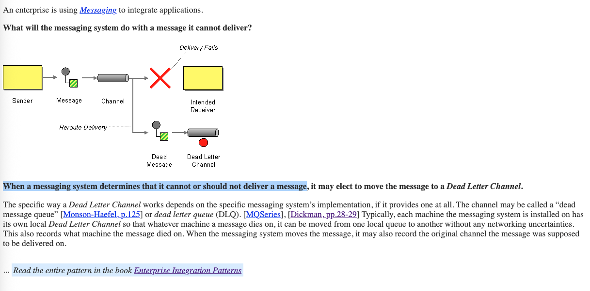
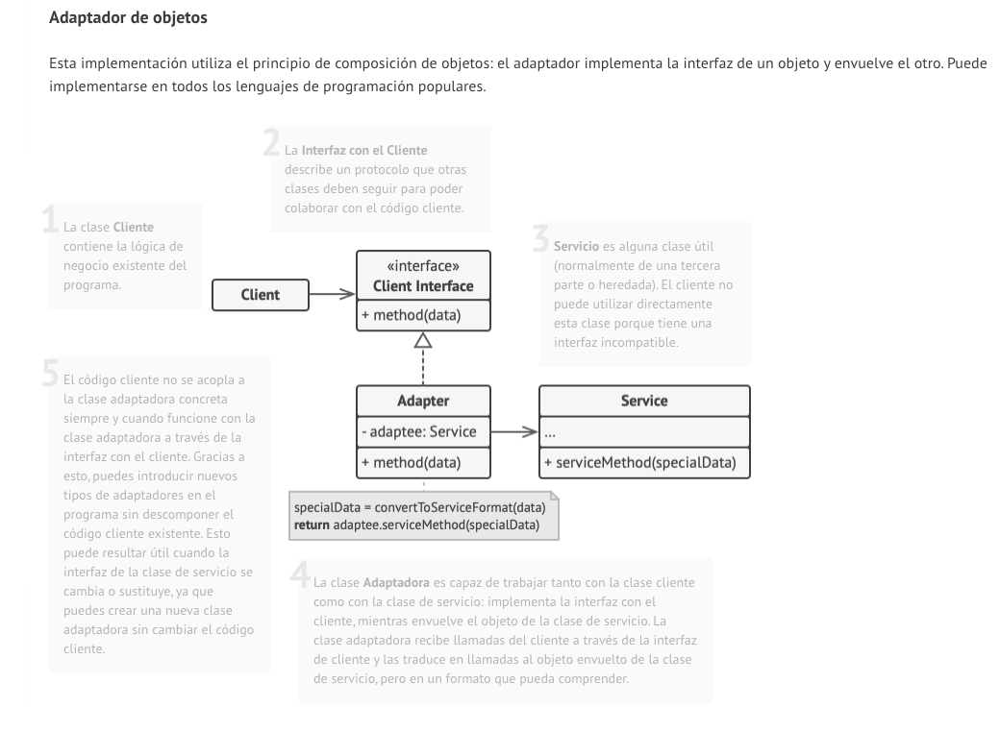

# Referencias de Arquitectura e Integración

## Tabla de contenidos

- [Libros y recursos fundamentales](#libros-y-recursos-fundamentales)
- [Patrones de integración (EIP)](#patrones-de-integración-eip)
  - [Message Broker](#message-broker)
  - [Dead-Letter Queue (DLQ)](#dead-letter-queue-dlq)
  - [Message Channel](#message-channel)
- [Arquitectura orientada a eventos (EDA)](#arquitectura-orientada-a-eventos-eda)
- [Patrones de diseño de software](#patrones-de-diseño-de-software)
  - [Adapter Pattern](#adapter-pattern)
- [Fundamentos de arquitectura en la nube](#fundamentos-de-arquitectura-en-la-nube)
  - [AWS Well-Architected Framework](#aws-well-architected-framework)
- [.NET y utilidades para la simulación](#net-y-utilidades-para-la-simulación)

---

## Libros y recursos fundamentales

Recurso base para patrones de integración de empresas (EIP), con un lenguaje común para modelar mensajería, colas y ruteo.

- Libro: Enterprise Integration Patterns
- Enlace: https://www.enterpriseintegrationpatterns.com/
- Ilustración:

---

## Patrones de integración (EIP)

### Message Broker

Patrón para desacoplar emisores y consumidores, habilitando ruteo, transformación y persistencia de mensajes para evitar cuellos de botella.

- Enlace: https://www.enterpriseintegrationpatterns.com/patterns/messaging/MessageBroker.html

### Dead-Letter Queue (DLQ)

Canal para mensajes que fallan de forma persistente. Facilita auditoría, observabilidad, notificaciones a soporte y reproceso controlado.

- Enlace: https://www.enterpriseintegrationpatterns.com/patterns/messaging/DeadLetterChannel.html

### Message Channel

Base del lenguaje de integración por mensajería. Define cómo los sistemas intercambian mensajes de forma fiable y escalable.

- Enlace: https://www.enterpriseintegrationpatterns.com/patterns/messaging/MessageChannel.html

---

## Arquitectura orientada a eventos (EDA)

Estilo arquitectónico centrado en eventos como “llegó el courier” o “pedido entregado”, promoviendo acoplamiento débil y procesamiento asíncrono/escalable.

- Enlace: https://aws.amazon.com/es/what-is/eda/

---

## Patrones de diseño de software

### Adapter Pattern

Permite integrar clientes heterogéneos (webhooks, email, SFTP, push) mediante una interfaz común y adaptadores específicos por cliente.

- Enlace: https://refactoring.guru/es/design-patterns/adapter

---

## Fundamentos de arquitectura en la nube

### AWS Well-Architected Framework

Pilares para diseñar y operar cargas de trabajo en la nube: excelencia operativa, seguridad, fiabilidad, eficiencia de rendimiento, optimización de costos y sostenibilidad.

- Enlace: https://aws.amazon.com/es/architecture/well-architected/

---

## .NET y utilidades para la simulación

Colección concurrente útil para simular colas en memoria con soporte de cancelación, ideal para pruebas de procesadores de eventos.

- BlockingCollection<T> (.NET)
- Enlace: https://learn.microsoft.com/en-us/dotnet/api/system.collections.concurrent.blockingcollection-1?view=net-9.0
