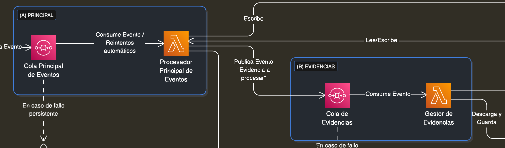

<div align="center">
    

<br>

[](https://github.com/usuario/repo/releases) [](https://opensource.org/licenses/MIT) [](https://github.com/usuario/repo/actions)

</div>

# **PT - Caso Práctico: Senior Integraciones** <br>by [Javier Solis 🧑‍💻🤖🚀🎯🔍](#contact)

Esta es una implementación de una solución para el caso práctico de "Senior Integraciones". El objetivo es demostrar una arquitectura de integración robusta, escalable y resiliente para sincronizar el estado de los pedidos entre un TMS externo y un OMS interno.

La solución está desarrollada en .NET 8 y simula la arquitectura diseñada sin necesidad de conectar a servicios externos reales, utilizando repositorios y colas en memoria.

## Tabla de contenidos

- [Entregables](#entregables)
  - [Diagrama de Arquitectura](#1-diagrama-de-arquitectura)
  - [Descripción de Componentes](#2-descripción-de-componentes)
  - [Proyecto en .NET](#3-proyecto-en-net)
  - [Justificación de Patrones de Diseño](#4-justificación-de-patrones-de-diseño)
- [Documentación](#documentación)
- [Setup](#setup)
- [Pruebas](#pruebas)
- [Contact](#contact)

# Entregables

### 1. Diagrama de Arquitectura

- 📄 **Ver Diagrama:** [`doc/1_arquitectura.md`](doc/1_arquitectura.md)

### 2. Descripción de Componentes

- 📄 **Ver Descripción:** [`doc/2_implementacion.md`](doc/2_implementacion.md)

### 3. Proyecto en .NET

- 🔗 **Repositorio:** `https://github.com/JavierSolis/pt_arquitect_integrations_1609_a`

### 4. Justificación de Patrones de Diseño

- 📄 **Ver Justificación:** [`doc/1_arquitectura.md#justificación-de-patrones-de-diseño`](doc/1_arquitectura.md#justificación-de-patrones-de-diseño)

1. Diagrama de Arquitectura: Un diagrama claro que muestre el flujo y los artefactos que el participante
   considere y los flujos de comunicación entre ellos.
   <br> 👉 [Click para ver detalles](doc/2_implementacion.md#versión-2-según-requerimientos)
   <br> ➡️ Corrección: [Click para ver detalles](doc/1_arquitectura.md#versión-2-según-requerimientos)

2. Descripción de Componentes: Una breve descripción de la función O componente en el diagrama.
   <br> 👉 [Click para ver descripción de componentes](doc/2_implementacion.md#versión-2-según-requerimientos)
   <br> ➡️ Corrección: [Click para ver descripción de componentes](doc/1_arquitectura.md#descripción-de-componentes)

3. Proyecto en .NET
   <br> 👉 [https://github.com/JavierSolis/pt_arquitect_integrations_1609_a](https://github.com/JavierSolis/pt_arquitect_integrations_1609_a)

4. Justificación de Patrones de Diseño.
   <br> 👉 [Click para ver detalles](doc/1_arquitectura.md#justificación-de-patrones-de-diseño)

# Documentación

_Toda la documentación se encuentra en la carpeta `/doc`._

### 📄 `doc/1_arquitectura.md`

_Este documento detalla el **"porqué"** de la solución. Contiene:_

- El **Diagrama de Arquitectura** completo.
- La **definición de conceptos clave** (Webhook, API Gateway, Colas, Multi-AZ).
- La **Justificación de los Patrones de Diseño** elegidos (Arquitectura Orientada a Eventos, Patrón Adaptador, etc.).

### 📄 `doc/2_implementacion.md`

_Este documento detalla el **"cómo"** se construyó la solución. Contiene:_

- El **Backlog de Implementación** (la lista de pasos y tareas seguidas).
- Detalles sobre la **Estructura del Proyecto** en .NET.
- Los **Escenarios de Prueba** y los comandos `curl` para ejecutarlos.

# Setup

1. Instalar :

- Visual Studio Code<br>
  https://code.visualstudio.com/
- Instalación del SDK 8.0<br>
  https://dotnet.microsoft.com/es-es/download/dotnet/8.0
- Instalación de la extensión C# Dev Kit<br>
  https://marketplace.visualstudio.com/items?itemName=ms-dotnettools.csdevkit

2. Verificar instalación

```shell
# comando
dotnet --version
# salida
8.0.414
```

3. Clonar el proyecto

```shell

git clone git@github.com:JavierSolis/pt_arquitect_integrations_1609_a.git

cd pt_arquitect_integrations_1609_a
```

4. Ejecutar el proyecto

```shell
# compilar
dotnet build

# ejecutar
dotnet run --project src/IntegrationService.Api/IntegrationService.Api.csproj
```

# Pruebas

[Click para ir a Paso 10 en '2.Implementación'](doc/2_implementacion.md#paso-10)
<br>➡️ Corrección: [Click para ir a Paso 10 en '2.Implementación'](doc/2_implementacion.md#paso-10-pruebas)

# Contact

<div align="center">
    
   

#### Javier Solis

👓 https://www.linkedin.com/in/android-developer-peru/

💼 https://www.behance.net/JavierJSolis

</div>
